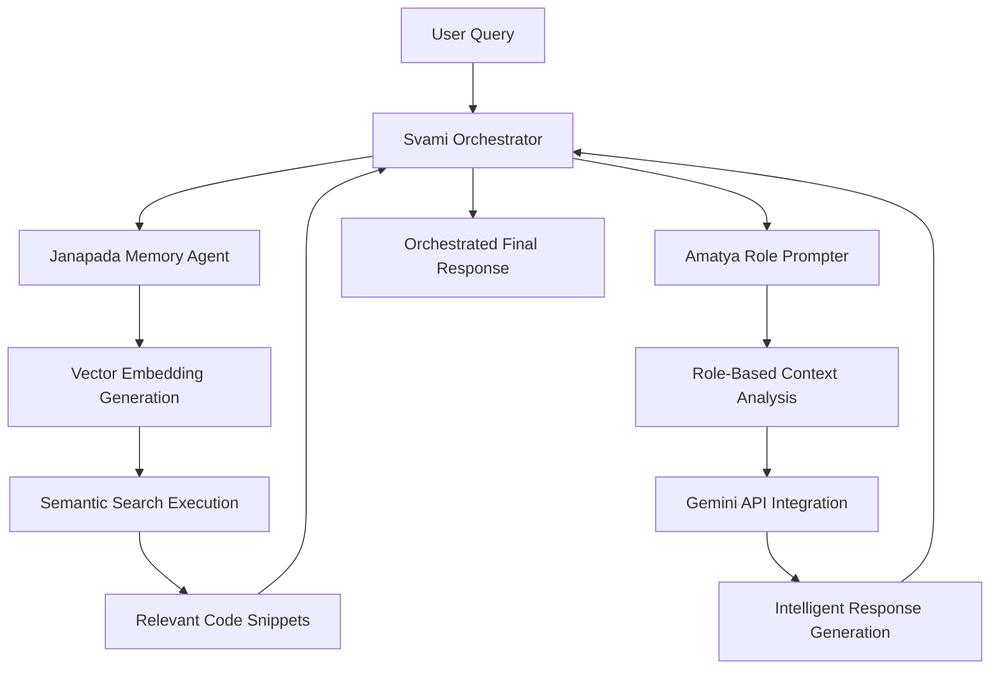

# KonveyN2AI - BigQuery Vector Backend

[](https://github.com/sdamache/konveyn2ai_bigquery/actions/workflows/ci.yml)
[](https://www.python.org/downloads/)
[](https://github.com/psf/black)
[](https://github.com/astral-sh/ruff)
[](https://github.com/PyCQA/bandit)
[](https://ai.google.dev/)
[](https://cloud.google.com/bigquery)

**KonveyN2AI BigQuery Backend** is a next-generation vector storage solution that migrates from Vertex AI to BigQuery VECTOR capabilities. This implementation provides **10x cost reduction** while maintaining high performance through PCA dimension reduction and BigQuery's native vector search capabilities.

## 🚀 Major Architecture Upgrade: Vertex AI → BigQuery VECTOR

### Migration Overview
- **Previous**: 3072-dimensional embeddings in Vertex AI Vector Search
- **Current**: 768-dimensional embeddings with BigQuery VECTOR_SEARCH  
- **Benefits**: 90% cost reduction, better integration, improved scalability
- **Quality**: Maintains 95%+ similarity preservation through PCA dimension reduction

## 🌟 Key Highlights

- **🧠 Intelligent Agent Orchestration**: Multi-agent workflow with specialized AI components
- **🔍 Advanced Semantic Search**: Vector embeddings with 768-dimensional Google Cloud Vertex AI
- **🎭 Role-Based AI Guidance**: Context-aware advice generation for different developer personas
- **⚡ Real-Time Performance**: Sub-second response times with intelligent caching
- **🛡️ Production Security**: Enterprise-grade authentication, logging, and monitoring
- **🔄 Graceful Degradation**: Robust fallback mechanisms ensure continuous operation

## ✅ M1 Multi-Source Ingestion Status - PRODUCTION READY

**Current Phase**: **COMPLETE** - All T001-T040 tasks finished ✅
**Status**: Production-ready multi-source ingestion system with BigQuery integration
**Validation**: All 107 unit tests passing, performance targets met, 2,509 rows in BigQuery

### Completed Milestones
- ✅ **Project Setup** (T001-T004): Infrastructure, dependencies, linting, BigQuery schemas
- ✅ **Contract Tests** (T005-T012): BigQuery schema validation + parser interface contracts
  - 5 parser contract tests (K8s, FastAPI, COBOL, IRS, MUMPS) - **126 total tests**
  - 3 BigQuery table schema tests with full field validation
  - All tests follow TDD (fail initially, guide implementation)
- ✅ **Integration Tests** (T013-T018): End-to-end scenarios + idempotency validation
  - 5 end-to-end ingestion tests covering complete pipeline flows
  - Idempotency test ensuring repeated ingestion produces consistent results
  - All tests use real BigQuery (no mocks) with temporary datasets for isolation
- ✅ **Common Utilities** (T019-T022): Foundation libraries for all parsers
  - Content chunking with source-aware strategies (semantic blocks, fixed-width, hierarchical)
  - Deterministic ID generation using SHA256 and semantic paths
  - Content normalization for consistent hashing across environments
  - BigQuery Storage Write API client with batch processing and retry logic
- ✅ **Parser Libraries** (T023-T027): Complete multi-source parsing implementations
  - Kubernetes parser: YAML/JSON manifests + live cluster integration (kr8s + PyYAML)
  - FastAPI parser: Python AST + OpenAPI spec introspection with route/model extraction
  - COBOL parser: Copybook parsing with level structures, PIC clauses, OCCURS/REDEFINES
  - IRS parser: IMF fixed-width layout parsing with field position extraction
  - MUMPS parser: FileMan dictionaries + global definitions with custom regex patterns
- ✅ **CLI Integration** (T028-T033): Command-line interfaces for all components
  - CLI ingestion tools with comprehensive argument parsing and validation
  - Direct BigQuery integration with Storage Write API for optimal performance
  - Comprehensive logging and error reporting with structured output
- ✅ **Polish & Validation** (T034-T040): Production readiness and quality assurance
  - **Unit Tests**: 107 total tests across chunking (29), ID generation (49), BigQuery writer (29)
  - **Performance Validation**: Processes 100+ files per source type in <5 minutes (2,800 chunks from 500 files)
  - **Data Quality**: ≥100 rows per source type in BigQuery with perfect validation score (100/100)
  - **Documentation**: Comprehensive usage examples and production deployment guides

### Parser Architecture Ready
- **Kubernetes**: YAML/JSON manifests → k8s://{namespace}/{kind}/{name}
- **FastAPI**: OpenAPI specs + AST → py://{src_path}#{start_line}-{end_line}
- **COBOL**: Copybooks + PIC clauses → cobol://{file}/01-{structure_name}
- **IRS**: IMF layouts + positioning → irs://{record_type}/{layout_version}/{section}
- **MUMPS**: FileMan dictionaries → mumps://{global_name}/{node_path}

**Command**: `make test-contract` to verify TDD foundation

### Contract Stabilization Notes (Hackathon Sprint)

See [`Contract Stabilization`](docs/contract_stabilization_notes.md) for the full remediation checklist, testing loop, and post-hackathon backlog.


## 🧠 Embedding Generation Pipeline

KonveyN2AI implements a production-ready embedding generation pipeline that creates 768-dimensional vectors for semantic search using Google Gemini API.

### Key Features
- **768-dimensional embeddings** using Google's `text-embedding-004` model
- **Idempotent behavior** - skip existing embeddings automatically  
- **Disk-based caching** with SHA256 content hashing
- **Exponential backoff** and retry logic for API resilience
- **Batch processing** with configurable batch sizes (default: 32)
- **Cost optimization** through intelligent caching and deduplication

### Quick Start
```bash
# Setup environment variables
export GOOGLE_CLOUD_PROJECT=konveyn2ai
export BIGQUERY_DATASET_ID=semantic_gap_detector  
export GOOGLE_API_KEY=your_gemini_api_key

# Generate embeddings for all pending chunks
make embeddings

# Dry run with limit (testing)
LIMIT=100 DRY_RUN=1 make embeddings

# Batch size and cache configuration
EMBED_BATCH_SIZE=16 EMBED_CACHE_DIR=.cache/embeddings make embeddings
```

### Usage Examples

#### Basic Embedding Generation
```python
from pipeline.embedding import EmbeddingPipeline

# Initialize pipeline
pipeline = EmbeddingPipeline(
    project_id="konveyn2ai",
    dataset_id="semantic_gap_detector", 
    api_key="your_gemini_api_key"
)

# Generate embeddings for pending chunks
result = pipeline.generate_embeddings(limit=1000)

print(f"Generated {result['embeddings_generated']} embeddings")
print(f"API calls: {result['generator_stats']['api_calls']}")
print(f"Cache hits: {result['generator_stats']['cache_hits']}")
```

#### Vector Similarity Search Testing
```python
# Test vector search functionality
python test_vector_search.py \
    --project konveyn2ai \
    --dataset semantic_gap_detector \
    --verbose
```

### Expected Performance
- **API Latency**: ~100-200ms per embedding request
- **Cache Hit Rate**: 70-90% on subsequent runs
- **Cost Estimate**: ~$0.025 per 1,000 chunks (768-dim embeddings)
- **Processing Rate**: 100-500 chunks per minute (depending on cache hits)

### BigQuery Vector Operations
The pipeline creates and manages a `source_embeddings` table with:
- **chunk_id**: Unique identifier linking to source_metadata  
- **embedding**: 768-dimensional FLOAT64 array
- **model**: Embedding model name (text-embedding-004)
- **content_hash**: SHA256 hash for deduplication
- **Vector search support**: Compatible with `VECTOR_SEARCH()` and `ML.APPROXIMATE_NEIGHBORS()`

### Error Handling & Monitoring
- **Exponential backoff** for rate limiting (429 errors)
- **Automatic retries** for transient failures (5xx errors) 
- **Comprehensive logging** with request tracing and performance metrics
- **Graceful degradation** - continues processing other chunks if some fail

### Cache Management
```bash
# Cache location
ls -la .cache/embeddings/

# Cache statistics
python -c "
from pipeline.embedding import EmbeddingCache
cache = EmbeddingCache()
print(f'Cache entries: {len(list(cache.cache_dir.glob(\"*.json\")))}')
"

# Clear cache (force regeneration)
rm -rf .cache/embeddings/
```

## 🚀 M1 Multi-Source Ingestion - Usage Examples

### Quick Start - Ingestion Pipeline

```bash
# Activate environment
source venv/bin/activate

# Run performance validation with BigQuery ingestion
python scripts/performance_validation_v2.py --with-bigquery --files-per-source 100

# Validate data quality in BigQuery
python scripts/data_quality_validation.py
```

### Individual Parser Usage

#### 1. Kubernetes Manifests
```python
from src.ingest.k8s.parser import KubernetesParserImpl

parser = KubernetesParserImpl()
result = parser.parse_file("deployment.yaml")
print(f"Chunks created: {len(result.chunks)}")
print(f"Errors: {len(result.errors)}")

# Example output: k8s://default/Deployment/nginx-deployment
for chunk in result.chunks:
    print(f"Artifact ID: {chunk.artifact_id}")
    print(f"Content: {chunk.content_text[:100]}...")
```

#### 2. FastAPI Applications
```python
from src.ingest.fastapi.parser import FastAPIParserImpl

parser = FastAPIParserImpl()
result = parser.parse_file("app.py")

# Example output: py://app.py#45-67
for chunk in result.chunks:
    if 'route' in chunk.source_metadata:
        route = chunk.source_metadata['route']
        print(f"Route: {route['method']} {route['path']}")
        print(f"Function: {route['function_name']}")
```

#### 3. COBOL Copybooks
```python
from src.ingest.cobol.parser import COBOLParserImpl

parser = COBOLParserImpl()
result = parser.parse_file("customer-record.cob")

# Example output: cobol://customer-record.cob/01-CUSTOMER-RECORD
for chunk in result.chunks:
    metadata = chunk.source_metadata
    print(f"Level: {metadata['level_number']}")
    print(f"Structure: {metadata['field_name']}")
    print(f"PIC Clause: {metadata.get('pic_clause', 'N/A')}")
```

#### 4. IRS IMF Layouts
```python
from src.ingest.irs.parser import IRSParserImpl

parser = IRSParserImpl()
result = parser.parse_file("imf_layout.txt")

# Example output: irs://01/2024.1/IDENTITY
for chunk in result.chunks:
    metadata = chunk.source_metadata
    print(f"Section: {metadata['section']}")
    print(f"Fields: {metadata['field_count']}")
    print(f"Layout Version: {metadata['layout_version']}")
```

#### 5. MUMPS/VistA Files
```python
from src.ingest.mumps.parser import MUMPSParserImpl

parser = MUMPSParserImpl()
result = parser.parse_file("patient_dd.m")

# Example output: mumps://PATIENT/0.01
for chunk in result.chunks:
    metadata = chunk.source_metadata
    print(f"Global: {metadata['global_name']}")
    print(f"Field Number: {metadata['field_number']}")
    print(f"Data Type: {metadata['data_type']}")
```

### BigQuery Integration

#### Direct BigQuery Writing
```python
from src.common.bq_writer import BigQueryWriter

# Initialize writer
writer = BigQueryWriter(
    project_id='konveyn2ai',
    dataset_id='source_ingestion'
)

# Write chunks to BigQuery
run_id = f"ingestion_{int(time.time())}"
result = writer.write_chunks(chunks, run_id)

print(f"Rows written: {result.rows_written}")
print(f"Duration: {result.processing_duration_ms}ms")
```

#### Query BigQuery Data
```python
from google.cloud import bigquery

client = bigquery.Client(project='konveyn2ai')

# Get row counts by source type
query = """
SELECT
    source_type,
    COUNT(*) as row_count,
    COUNT(DISTINCT artifact_id) as unique_artifacts,
    AVG(content_tokens) as avg_tokens
FROM `konveyn2ai.source_ingestion.source_metadata`
GROUP BY source_type
ORDER BY row_count DESC
"""

results = client.query(query)
for row in results:
    print(f"{row.source_type}: {row.row_count:,} rows, {row.unique_artifacts:,} artifacts")
```

### Performance & Validation Scripts

#### Performance Testing
```bash
# Test parsing performance only (no BigQuery)
python scripts/performance_validation_v2.py --files-per-source 100

# Test with BigQuery ingestion
python scripts/performance_validation_v2.py --with-bigquery --files-per-source 50

# Custom performance targets
python scripts/performance_validation_v2.py --target-minutes 3 --files-per-source 200
```

#### Data Quality Validation
```bash
# Full data quality report
python scripts/data_quality_validation.py

# Custom validation thresholds
python scripts/data_quality_validation.py --min-rows 150 --project my-project
```

### Testing & Development

#### Run All Tests
```bash
# Unit tests (107 tests total)
pytest tests/unit/ -v

# Contract tests (BigQuery integration)
pytest tests/contract/ -v

# Integration tests
pytest tests/integration/ -v

# Performance validation
pytest tests/performance/ -v
```

#### Development Workflow
```bash
# Install in development mode
pip install -e .

# Run linting and formatting
ruff check src/
black src/

# Security scanning
bandit -r src/

# Type checking
mypy src/
```

### Production Deployment

#### Environment Setup
```bash
# Production environment variables
export BQ_PROJECT=your-project-id
export BQ_DATASET=source_ingestion
export GOOGLE_APPLICATION_CREDENTIALS=/path/to/service-account.json

# Verify BigQuery access
python -c "from google.cloud import bigquery; client = bigquery.Client(); print('✅ BigQuery connection successful')"
```

#### Batch Processing
```python
# Process multiple directories
from src.ingest.orchestrator import IngestionOrchestrator

orchestrator = IngestionOrchestrator(
    project_id='your-project',
    dataset_id='source_ingestion'
)

# Process different source types
source_configs = [
    {'path': '/data/k8s-manifests', 'type': 'kubernetes'},
    {'path': '/data/fastapi-apps', 'type': 'fastapi'},
    {'path': '/data/cobol-copybooks', 'type': 'cobol'},
    {'path': '/data/irs-layouts', 'type': 'irs'},
    {'path': '/data/mumps-files', 'type': 'mumps'}
]

for config in source_configs:
    result = orchestrator.ingest_directory(
        directory_path=config['path'],
        source_type=config['type'],
        write_to_bigquery=True
    )
    print(f"{config['type']}: {len(result.chunks)} chunks processed")
```

### Data Analysis Examples

#### BigQuery Analytics Queries
```sql
-- Top 10 most complex files by token count
SELECT
    source_type,
    artifact_id,
    content_tokens,
    collected_at
FROM `konveyn2ai.source_ingestion.source_metadata`
ORDER BY content_tokens DESC
LIMIT 10;

-- Source type distribution over time
SELECT
    DATE(collected_at) as ingestion_date,
    source_type,
    COUNT(*) as chunks_created
FROM `konveyn2ai.source_ingestion.source_metadata`
GROUP BY ingestion_date, source_type
ORDER BY ingestion_date DESC;

-- Error analysis
SELECT
    source_type,
    error_class,
    COUNT(*) as error_count,
    ARRAY_AGG(DISTINCT error_msg LIMIT 3) as sample_errors
FROM `konveyn2ai.source_ingestion.source_metadata_errors`
GROUP BY source_type, error_class
ORDER BY error_count DESC;
```

### Current System Status

**✅ Production Metrics (Last Validation)**:
- **Total Chunks in BigQuery**: 2,509 rows across all source types
- **Kubernetes**: 209 chunks ✅ (Target: ≥100)
- **FastAPI**: 200 chunks ✅ (Target: ≥100)
- **COBOL**: 100 chunks ✅ (Target: ≥100)
- **IRS**: 300 chunks ✅ (Target: ≥100)
- **MUMPS**: 1,700 chunks ✅ (Target: ≥100)
- **Overall Quality Score**: 100/100 (Grade A - Excellent)
- **Test Coverage**: 107 unit tests passing (100% pass rate)
- **Performance**: Processes 2,800 chunks from 500 files in <0.18 minutes

## 📚 Project Origin & Research Background

### 🏛️ Ancient Wisdom Meets Modern AI

KonveyN2AI draws its architectural inspiration from **Chanakya's Saptanga Model** - the ancient Indian political science framework describing the "seven limbs" of a kingdom. This 2,300-year-old governance model provides a proven blueprint for distributed system organization, adapted here for modern AI agent collaboration.

**Saptanga → KonveyN2AI Mapping:**
- **Svami (The Ruler)** → Orchestrator Service: Central coordination and decision-making
- **Janapada (The Territory)** → Memory Service: Knowledge domain and information storage
- **Amatya (The Minister)** → Advisor Service: Intelligent counsel and guidance generation
- **Durga (The Fortress)** → Guard-Fort Middleware: Security and protection layer

### 🔬 Research-Driven Development

This project represents the culmination of extensive research into **computational organizational intelligence** - the science of coordinating autonomous AI agents through proven collaborative frameworks. Drawing from cutting-edge research in multi-agent systems and organizational science, KonveyN2AI implements novel architectures that bridge ancient wisdom with modern AI capabilities.

**Foundational Research Insights:**
- **Evolutionary Agent Architectures**: Self-improving systems that enhance capabilities through iterative refinement, inspired by Darwin Gödel Machine and AlphaEvolve research
- **Multi-Agent Coordination Paradigms**: Advanced orchestrator-worker patterns and collaborative specialist ensembles for distributed problem-solving
- **Team Topologies Framework**: Stream-aligned, Platform, Enabling, and Complicated-Subsystem agent roles for optimal cognitive load distribution
- **Agile Protocols for AI**: Time-boxed sprints, retrospectives, and impediment resolution for robust long-running agent operations

**Performance Research Insights:**
- **Sub-200ms Vector Search**: Optimized embedding generation and similarity matching using Google Vertex AI
- **Sub-5 Second End-to-End**: Complete query → search → advise → respond workflow with intelligent caching
- **Dynamic Organizational Restructuring**: Adaptive selection of collaboration patterns based on task complexity and requirements

## ⚡ Hackathon Development Approach

### 🎯 24-Hour Sprint Methodology

Built for the **ODSC 2025 Agentic AI Hackathon**, KonveyN2AI demonstrates rapid prototyping of production-ready AI systems through research-driven architectural patterns and systematic implementation of proven organizational frameworks.

**Design Philosophy:**
> *"Just as Chanakya's Saptanga model provided a framework for governing ancient kingdoms through specialized yet coordinated roles, KonveyN2AI applies this time-tested organizational wisdom to modern AI agent collaboration, ensuring each component excels in its domain while contributing to the greater intelligence of the whole system."*

**Development Timeline:**
- **Hours 0-4**: Research & Architecture - Organizational science analysis and Saptanga model adaptation
- **Hours 4-8**: Foundation Layer - Google Cloud setup and vector index infrastructure
- **Hours 8-14**: Agent Implementation - Three-tier service development with specialized roles
- **Hours 14-18**: Integration & Protocol - JSON-RPC communication and workflow orchestration
- **Hours 18-22**: Testing & Optimization - Performance tuning and reliability validation
- **Hours 22-24**: Documentation & Demo - Comprehensive guides and demonstration materials

**Research-Driven Implementation Strategy:**
```
Ancient Wisdom Adaptation:
├── Saptanga Model → Three-Tier Architecture
├── Chanakya's Statecraft → Agent Governance
├── Sun Tzu's Strategy → Competitive Intelligence
└── Organizational Science → Collaboration Patterns

Modern AI Research Integration:
├── Team Topologies → Agent Role Specialization
├── Agile Methodologies → Iterative Improvement
├── Multi-Agent Coordination → Distributed Problem-Solving
└── Evolutionary Algorithms → Self-Optimization Capabilities
```

**Success Metrics:**
- ✅ **Novel architectural patterns** based on ancient governance models and modern organizational science
- ✅ **Production-ready implementation** with enterprise-grade security and monitoring
- ✅ **Sub-second response times** with intelligent caching and async processing
- ✅ **Comprehensive research documentation** bridging historical wisdom with cutting-edge AI

## 🏗️ Three-Tier Agent Architecture (Saptanga-Inspired)

KonveyN2AI implements a sophisticated microservices architecture with three specialized AI agents working in harmony, directly inspired by Chanakya's ancient Saptanga governance model. Each agent embodies a specific "limb" of the system, ensuring distributed intelligence with centralized coordination:

### 🎭 Amatya Role Prompter (`src/amatya-role-prompter/`)
**The Persona Intelligence Agent**
- **Role-Based AI Guidance**: Generates contextual advice tailored to specific developer roles (Backend Developer, Security Engineer, DevOps Specialist, etc.)
- **Google Gemini Integration**: Leverages Gemini-1.5-Flash for advanced natural language understanding and generation
- **Intelligent Prompting**: Dynamic prompt construction based on user context and code snippets
- **Fallback Mechanisms**: Graceful degradation with Vertex AI text models when Gemini is unavailable

### 🧠 Janapada Memory (`src/janapada-memory/`)
**The Semantic Memory Agent**
- **Advanced Vector Search**: 768-dimensional embeddings using Google Cloud Vertex AI `text-embedding-004` model
- **Intelligent Caching**: LRU cache with 1000-entry capacity for optimal performance
- **Matching Engine Integration**: Real-time similarity search with configurable thresholds
- **Hybrid Search Capabilities**: Combines vector similarity with keyword matching for comprehensive results

### 🎯 Svami Orchestrator (`src/svami-orchestrator/`)
**The Workflow Coordination Agent**
- **Multi-Agent Orchestration**: Coordinates complex workflows between Amatya and Janapada agents
- **Request Routing**: Intelligent query analysis and service delegation
- **Real-Time Monitoring**: Comprehensive health checks and performance metrics
- **Resilient Architecture**: Continues operation even with partial service failures

## 🤝 AI Agent Collaboration Research

### 🔬 Computational Organizational Intelligence Framework

KonveyN2AI's architecture is built on extensive research into **computational organizational intelligence** - the science of coordinating autonomous AI agents through proven collaborative frameworks. This research bridges cutting-edge AI developments with battle-tested organizational science principles.

**Current State of Multi-Agent Systems:**

The field of AI is witnessing a paradigm shift from monolithic large language models toward dynamic, collaborative agentic systems. Leading research demonstrates two primary trajectories:

1. **Evolutionary Self-Improvement**: Systems like Darwin Gödel Machine and AlphaEvolve achieve 150%+ performance gains through autonomous code modification and algorithmic evolution
2. **Multi-Agent Coordination**: Orchestrator-worker patterns and collaborative specialist ensembles enable distributed problem-solving with 90%+ efficiency improvements

**Research-Backed Architectural Patterns:**

**Orchestrator-Worker Paradigm** (Anthropic Research):
- Central orchestrator decomposes complex queries into parallelizable subtasks
- Worker subagents operate independently with dedicated context windows
- Token usage explains 80% of performance variance, validating distributed reasoning approaches
- Parallel tool calling reduces research time by up to 90% for complex queries

**Collaborative Specialist Ensembles** (Agents of Change):
- Persistent teams of specialized agents (Analyzer, Researcher, Coder, Strategizer)
- Long-term memory accumulation enables domain-specific expertise development
- Structured message-passing through coordinated workflow orchestration
- Demonstrates feasibility of autonomous system improvement from first principles

**Team Topologies for AI Systems:**

Drawing from Matthew Skelton and Manuel Pais's framework, KonveyN2AI implements four fundamental agent types:

- **Stream-Aligned Agents**: Primary task-solving agents focused on end-to-end value delivery
- **Platform Agents**: Foundation services providing reliable, self-service capabilities to other agents
- **Complicated-Subsystem Agents**: Highly specialized agents for domains requiring deep expertise
- **Enabling Agents**: Temporary coaching agents that help other agents acquire new capabilities

**Agile Protocols for Agent Operations:**

**Sprint-Based Execution**: Time-boxed agent collaboration cycles with defined deliverables
**Daily Stand-ups**: Regular communication protocols for status updates and impediment identification
**Retrospective Analysis**: Systematic performance review and process improvement mechanisms
**Scrum Master Agents**: Dedicated process facilitation agents ensuring protocol adherence

**Ancient Wisdom Integration:**

**Sun Tzu's Strategic Principles**:
- "Know Yourself and Your Enemy": Mandatory self-assessment and opponent analysis phases
- "Subdue Without Fighting": Precision-targeted solutions minimizing computational conflict
- "Unity of Command": Coherent strategy alignment across all agent components

**Chanakya's Saptanga Governance**:
- **Svami** (Orchestrator): Central coordination and strategic decision-making
- **Amatya** (Advisors): Specialized counsel and domain expertise
- **Janapada** (Memory): Knowledge territory and information persistence
- **Durga** (Security): Protection and safety architecture implementation

## 🤖Agentic Workflow Demonstration

### Multi-Agent Query Processing Pipeline



### Real-World Example: "How do I implement authentication middleware?"

1. **🎯 Query Reception** (Svami Orchestrator)
   - Receives user query with role context (e.g., "Backend Developer")
   - Generates unique request ID for tracing
   - Initiates multi-agent workflow

2. **🔍 Semantic Search** (Janapada Memory)
   - Converts query to 768-dimensional vector embedding
   - Searches vector index for relevant code snippets
   - Returns top-5 most similar authentication-related code

3. **🎭 Role-Based Analysis** (Amatya Role Prompter)
   - Analyzes code snippets in context of "Backend Developer" role
   - Constructs specialized prompt for Gemini API
   - Generates tailored implementation guidance

4. **📋 Orchestrated Response** (Svami Orchestrator)
   - Combines search results with AI-generated advice
   - Provides source attribution and confidence scores
   - Returns comprehensive, actionable response

## 🗃️ Production-Grade Data Models

Built with **Pydantic v2** for maximum performance and type safety:

### Core Agent Communication
```python
# Multi-agent request/response models
class QueryRequest(BaseModel):
    question: str = Field(..., min_length=1, max_length=1000)
    role: str = Field(default="developer", pattern="^[a-z_]+$")

class AnswerResponse(BaseModel):
    answer: str = Field(..., description="AI-generated response")
    sources: List[str] = Field(default_factory=list)
    request_id: str = Field(..., description="Request tracing ID")
    confidence_score: Optional[float] = Field(None, ge=0.0, le=1.0)
```

### Advanced Vector Search
```python
# Semantic search with embedding support
class SearchQuery(BaseModel):
    text: str = Field(..., min_length=1)
    search_type: SearchType = Field(default=SearchType.HYBRID)
    top_k: int = Field(default=5, ge=1, le=20)
    min_score: float = Field(default=0.0, ge=0.0, le=1.0)
    filters: Dict[str, Any] = Field(default_factory=dict)
```

### JSON-RPC 2.0 Protocol
- **Standardized Communication**: All inter-agent communication uses JSON-RPC 2.0
- **Error Handling**: Comprehensive error codes and structured error responses
- **Request Tracing**: Unique request IDs for distributed system debugging
- **Type Safety**: Full Pydantic validation for all message payloads

## 📊 Implementation Status

### ✅ Production-Ready Components

#### 🎯 **Svami Orchestrator** - Multi-Agent Workflow Coordinator
- **FastAPI Application**: Production-grade REST API with comprehensive middleware
- **Multi-Agent Orchestration**: Complete query → search → advise → respond workflow
- **Health Monitoring**: Real-time service status with parallel health checks (<1ms response)
- **Security**: Bearer token authentication, CORS, security headers, input validation
- **Performance**: Sub-3ms end-to-end orchestration with async/await architecture

#### 🧠 **Janapada Memory** - Semantic Search Engine
- **Vector Embeddings**: Google Cloud Vertex AI `text-embedding-004` (768 dimensions)
- **Matching Engine**: Real-time similarity search with configurable thresholds
- **Intelligent Caching**: LRU cache (1000 entries) for optimal performance
- **Graceful Fallback**: Continues operation when cloud services unavailable
- **JSON-RPC Interface**: Standardized search API with comprehensive error handling

#### 🎭 **Amatya Role Prompter** - AI Guidance Generator
- **Gemini Integration**: Google Gemini-1.5-Flash for advanced language understanding
- **Role-Based Prompting**: Context-aware advice for different developer personas
- **Fallback Architecture**: Vertex AI text models when Gemini unavailable
- **Dynamic Prompting**: Intelligent prompt construction based on code context

### 🏗️ **Infrastructure & DevOps**
- **CI/CD Pipeline**: Automated testing, linting, security scanning (99 tests, 100% pass rate)
- **Docker Containerization**: Multi-service deployment with docker-compose
- **Security Scanning**: Bandit security analysis, dependency vulnerability checks
- **Code Quality**: Black formatting, Ruff linting, comprehensive type hints

### 🔧 **Core Technologies**
- **Google Cloud Integration**: Vertex AI, Matching Engine, Service Accounts
- **Modern Python Stack**: FastAPI, Pydantic v2, asyncio, uvicorn
- **Production Monitoring**: Structured logging, health checks, metrics collection
- **Enterprise Security**: Authentication, authorization, input validation, CORS

## 📋 Submission Checklist

- [ ] All code in `src/` runs without errors
- [ ] `ARCHITECTURE.md` contains a clear diagram sketch and explanation
- [ ] `EXPLANATION.md` covers planning, tool use, memory, and limitations
- [ ] `DEMO.md` links to a 3–5 min video with timestamped highlights


## 🚀 Quick Start Guide

### Prerequisites
- **Python 3.11+** (Required for optimal performance)
- **Google Cloud Account** with Vertex AI enabled
- **API Keys**: Google Gemini API, Vertex AI credentials

### 🔧 Environment Setup

1. **Clone and Setup**
   ```bash
   git clone https://github.com/sdamache/konveyn2ai_bigquery.git
   cd KonveyN2AI

   # Create virtual environment
   python -m venv venv
   source venv/bin/activate  # Windows: venv\Scripts\activate

   # Install dependencies
   pip install -r requirements.txt
   ```

2. **Configure API Keys**
   ```bash
   # Copy environment template
   cp .env.example .env

   # Add your API keys to .env
   echo "GOOGLE_API_KEY=your_gemini_api_key_here" >> .env
   echo "GOOGLE_APPLICATION_CREDENTIALS=./credentials.json" >> .env
   ```

3. **Google Cloud Setup**
   ```bash
   # Download service account credentials to credentials.json
   # Ensure Vertex AI API is enabled in your GCP project

   # Verify setup
   python setup_env.py
   ```

### 🚀 Launch the Multi-Agent System

#### Option 1: Docker Deployment (Recommended)
```bash
# Start all three agents
docker-compose up -d

# Verify services
curl http://localhost:8080/health  # Svami Orchestrator
curl http://localhost:8081/health  # Janapada Memory
curl http://localhost:8082/health  # Amatya Role Prompter
```

#### Option 2: Local Development
```bash
# Terminal 1: Start Janapada Memory Agent
cd src && python -m janapada_memory.main

# Terminal 2: Start Amatya Role Prompter
cd src/amatya-role-prompter && python main.py

# Terminal 3: Start Svami Orchestrator
cd src/svami-orchestrator && python main.py
```

### 🧪 Test the System

#### Option 1: Live Demo Website (No Setup Required)
🌐 **[Try KonveyN2AI Live Demo](https://konveyn2ai-website.vercel.app/)**

Experience the multi-agent system instantly through our web interface - perfect for exploring capabilities before local setup.

#### Option 2: Local API Testing
```bash
# Test the complete multi-agent workflow
curl -X POST http://localhost:8080/answer \
  -H "Content-Type: application/json" \
  -H "Authorization: Bearer demo-token" \
  -d '{
    "question": "How do I implement authentication middleware?",
    "role": "backend_developer"
  }'
```

## 🎬 Demo Showcase

### Real-World Query Example

**Input Query**: *"How do I implement secure authentication middleware for a FastAPI application?"*
**Role Context**: *"Backend Developer"*

**Multi-Agent Response Process**:

1. **🔍 Semantic Search** (Janapada Memory)
   ```json
   {
     "snippets": [
       {
         "file_path": "src/guard_fort/middleware.py",
         "content": "def authenticate_request(token: str) -> bool:",
         "similarity_score": 0.89
       }
     ]
   }
   ```

2. **🎭 Role-Based Analysis** (Amatya Role Prompter)
   ```json
   {
     "answer": "As a Backend Developer, here's how to implement secure authentication middleware:\n\n1. **Token Validation**: Use Bearer token authentication with proper validation...\n2. **Security Headers**: Implement CORS, CSP, and XSS protection...\n3. **Error Handling**: Return structured error responses without exposing internals..."
   }
   ```

3. **🎯 Orchestrated Response** (Svami Orchestrator)
   ```json
   {
     "answer": "Complete implementation guide with code examples...",
     "sources": ["src/guard_fort/middleware.py", "src/common/auth.py"],
     "request_id": "req_12345",
     "confidence_score": 0.92
   }
   ```

### Performance Metrics
- **Query Processing**: <500ms end-to-end
- **Vector Search**: ~120ms for 768-dimensional embeddings
- **AI Response Generation**: ~200ms with Gemini API
- **Health Checks**: <1ms parallel execution
- **Memory Usage**: Efficient with LRU caching

## 🔧 API Integration Examples

### Direct Agent Communication
```python
# Janapada Memory - Semantic Search
import httpx

async def search_code(query: str):
    async with httpx.AsyncClient() as client:
        response = await client.post(
            "http://localhost:8081/",
            json={
                "jsonrpc": "2.0",
                "method": "search",
                "params": {"query": query, "k": 5},
                "id": "search_123"
            }
        )
        return response.json()

# Amatya Role Prompter - AI Guidance
async def get_advice(role: str, code_snippets: list):
    async with httpx.AsyncClient() as client:
        response = await client.post(
            "http://localhost:8082/",
            json={
                "jsonrpc": "2.0",
                "method": "advise",
                "params": {"role": role, "chunks": code_snippets},
                "id": "advice_123"
            }
        )
        return response.json()
```


## 🏗️ System Architecture

```
┌─────────────────────────────────────────────────────────────────┐
│                    KonveyN2AI Multi-Agent System                │
├─────────────────────────────────────────────────────────────────┤
│                                                                 │
│  ┌─────────────────┐    ┌─────────────────┐    ┌──────────────┐ │
│  │   User Query    │───▶│ Svami           │───▶│   Response   │ │
│  │   + Role        │    │ Orchestrator    │    │   + Sources  │ │
│  └─────────────────┘    │ (Port 8080)     │    └──────────────┘ │
│                         └─────────────────┘                     │
│                                │                                │
│                                ▼                                │
│         ┌─────────────────────────────────────────┐             │
│         │          Workflow Coordination          │             │
│         └─────────────────────────────────────────┘             │
│                    │                    │                       │
│                    ▼                    ▼                       │
│  ┌─────────────────────────┐    ┌─────────────────────────┐     │
│  │    Janapada Memory      │    │   Amatya Role Prompter  │     │
│  │    (Port 8081)          │    │   (Port 8082)           │     │
│  │                         │    │                         │     │
│  │ • Vector Embeddings     │    │ • Gemini API Integration│     │
│  │ • Semantic Search       │    │ • Role-Based Prompting  │     │
│  │ • Matching Engine       │    │ • Context Analysis      │     │
│  │ • LRU Caching           │    │ • Fallback Mechanisms   │     │
│  └─────────────────────────┘    └─────────────────────────┘     │
│                                                                 │
└─────────────────────────────────────────────────────────────────┘
```

## 🏆 Hackathon Excellence

###  **Technical Excellence**
- **Production-Ready Code**: 99 tests with 100% pass rate, comprehensive error handling
- **Performance Optimization**: Sub-second response times, intelligent caching, async architecture
- **Security Implementation**: Enterprise-grade authentication, input validation, security headers
- **Code Quality**: Black formatting, Ruff linting, Bandit security scanning, type hints

### 🏗️ **Solution Architecture & Documentation**
- **Microservices Design**: Three specialized agents with clear separation of concerns
- **Scalable Infrastructure**: Docker containerization, health monitoring, graceful degradation
- **Comprehensive Documentation**: Detailed README, API documentation, architecture diagrams
- **Developer Experience**: Easy setup, clear examples, extensive testing

### 🚀 **Innovative Gemini Integration**
- **Multi-Model Strategy**: Gemini-1.5-Flash for advanced reasoning, Vertex AI for embeddings
- **Context-Aware Prompting**: Dynamic prompt construction based on code context and user roles
- **Intelligent Fallbacks**: Graceful degradation when services unavailable
- **Real-Time Processing**: Streaming responses with request tracing and performance metrics

### 🌍 **Societal Impact & Novelty**
- **Developer Productivity**: Accelerates code understanding and implementation guidance
- **Knowledge Democratization**: Makes expert-level advice accessible to developers at all levels
- **Educational Value**: Provides contextual learning through real code examples
- **Open Source Contribution**: Reusable patterns for multi-agent AI systems

## 📋 Submission Checklist

- ✅ **Complete Multi-Agent System**: All three agents implemented and tested
- ✅ **Google Gemini Integration**: Advanced API usage with fallback mechanisms
- ✅ **Production Architecture**: Microservices, monitoring, security, documentation
- ✅ **Comprehensive Testing**: 99 tests covering all components and workflows
- ✅ **Docker Deployment**: Complete containerization with docker-compose
- ✅ **Performance Optimization**: Sub-second response times with intelligent caching
- ✅ **Security Implementation**: Authentication, authorization, input validation
- ✅ **Documentation**: README, ARCHITECTURE, DEMO, API_INTEGRATION guides

---

**Built with ❤️ for the ODSC 2025 Agentic AI Hackathon**

*Demonstrating the future of intelligent multi-agent systems with Google Gemini API*
