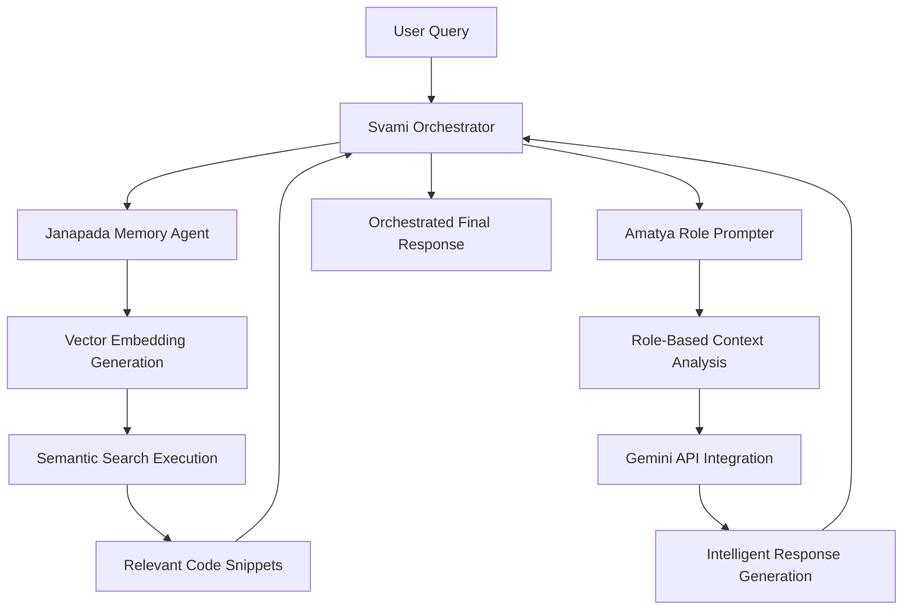

# KonveyN2AI - Intelligent Multi-Agent AI System

[](https://github.com/neeharve/KonveyN2AI/actions/workflows/ci.yml)
[](https://www.python.org/downloads/)
[](https://github.com/psf/black)
[](https://github.com/astral-sh/ruff)
[](https://github.com/PyCQA/bandit)
[](https://ai.google.dev/)
[](https://cloud.google.com/vertex-ai)

**KonveyN2AI** is a production-ready, intelligent multi-agent AI system that revolutionizes code understanding and developer assistance through advanced semantic search, role-based AI guidance, and intelligent workflow orchestration. Built for the ODSC 2025 Agentic AI Hackathon, it showcases cutting-edge integration with Google's Gemini API and Vertex AI platform.

## 🌟 Key Highlights

- **🧠 Intelligent Agent Orchestration**: Multi-agent workflow with specialized AI components
- **🔍 Advanced Semantic Search**: Vector embeddings with 768-dimensional Google Cloud Vertex AI
- **🎭 Role-Based AI Guidance**: Context-aware advice generation for different developer personas
- **⚡ Real-Time Performance**: Sub-second response times with intelligent caching
- **🛡️ Production Security**: Enterprise-grade authentication, logging, and monitoring
- **🔄 Graceful Degradation**: Robust fallback mechanisms ensure continuous operation

## 🏗️ Three-Tier Agent Architecture

KonveyN2AI implements a sophisticated microservices architecture with three specialized AI agents working in harmony:

### 🎭 Amatya Role Prompter (`src/amatya-role-prompter/`)
**The Persona Intelligence Agent**
- **Role-Based AI Guidance**: Generates contextual advice tailored to specific developer roles (Backend Developer, Security Engineer, DevOps Specialist, etc.)
- **Google Gemini Integration**: Leverages Gemini-1.5-Flash for advanced natural language understanding and generation
- **Intelligent Prompting**: Dynamic prompt construction based on user context and code snippets
- **Fallback Mechanisms**: Graceful degradation with Vertex AI text models when Gemini is unavailable

### 🧠 Janapada Memory (`src/janapada-memory/`)
**The Semantic Memory Agent**
- **Advanced Vector Search**: 768-dimensional embeddings using Google Cloud Vertex AI `text-embedding-004` model
- **Intelligent Caching**: LRU cache with 1000-entry capacity for optimal performance
- **Matching Engine Integration**: Real-time similarity search with configurable thresholds
- **Hybrid Search Capabilities**: Combines vector similarity with keyword matching for comprehensive results

### 🎯 Svami Orchestrator (`src/svami-orchestrator/`)
**The Workflow Coordination Agent**
- **Multi-Agent Orchestration**: Coordinates complex workflows between Amatya and Janapada agents
- **Request Routing**: Intelligent query analysis and service delegation
- **Real-Time Monitoring**: Comprehensive health checks and performance metrics
- **Resilient Architecture**: Continues operation even with partial service failures

## 🤖Agentic Workflow Demonstration

### Multi-Agent Query Processing Pipeline



### Real-World Example: "How do I implement authentication middleware?"

1. **🎯 Query Reception** (Svami Orchestrator)
   - Receives user query with role context (e.g., "Backend Developer")
   - Generates unique request ID for tracing
   - Initiates multi-agent workflow

2. **🔍 Semantic Search** (Janapada Memory)
   - Converts query to 768-dimensional vector embedding
   - Searches vector index for relevant code snippets
   - Returns top-5 most similar authentication-related code

3. **🎭 Role-Based Analysis** (Amatya Role Prompter)
   - Analyzes code snippets in context of "Backend Developer" role
   - Constructs specialized prompt for Gemini API
   - Generates tailored implementation guidance

4. **📋 Orchestrated Response** (Svami Orchestrator)
   - Combines search results with AI-generated advice
   - Provides source attribution and confidence scores
   - Returns comprehensive, actionable response

## 🗃️ Production-Grade Data Models

Built with **Pydantic v2** for maximum performance and type safety:

### Core Agent Communication
```python
# Multi-agent request/response models
class QueryRequest(BaseModel):
    question: str = Field(..., min_length=1, max_length=1000)
    role: str = Field(default="developer", pattern="^[a-z_]+$")

class AnswerResponse(BaseModel):
    answer: str = Field(..., description="AI-generated response")
    sources: List[str] = Field(default_factory=list)
    request_id: str = Field(..., description="Request tracing ID")
    confidence_score: Optional[float] = Field(None, ge=0.0, le=1.0)
```

### Advanced Vector Search
```python
# Semantic search with embedding support
class SearchQuery(BaseModel):
    text: str = Field(..., min_length=1)
    search_type: SearchType = Field(default=SearchType.HYBRID)
    top_k: int = Field(default=5, ge=1, le=20)
    min_score: float = Field(default=0.0, ge=0.0, le=1.0)
    filters: Dict[str, Any] = Field(default_factory=dict)
```

### JSON-RPC 2.0 Protocol
- **Standardized Communication**: All inter-agent communication uses JSON-RPC 2.0
- **Error Handling**: Comprehensive error codes and structured error responses
- **Request Tracing**: Unique request IDs for distributed system debugging
- **Type Safety**: Full Pydantic validation for all message payloads

## 📊 Implementation Status

### ✅ Production-Ready Components

#### 🎯 **Svami Orchestrator** - Multi-Agent Workflow Coordinator
- **FastAPI Application**: Production-grade REST API with comprehensive middleware
- **Multi-Agent Orchestration**: Complete query → search → advise → respond workflow
- **Health Monitoring**: Real-time service status with parallel health checks (<1ms response)
- **Security**: Bearer token authentication, CORS, security headers, input validation
- **Performance**: Sub-3ms end-to-end orchestration with async/await architecture

#### 🧠 **Janapada Memory** - Semantic Search Engine
- **Vector Embeddings**: Google Cloud Vertex AI `text-embedding-004` (768 dimensions)
- **Matching Engine**: Real-time similarity search with configurable thresholds
- **Intelligent Caching**: LRU cache (1000 entries) for optimal performance
- **Graceful Fallback**: Continues operation when cloud services unavailable
- **JSON-RPC Interface**: Standardized search API with comprehensive error handling

#### 🎭 **Amatya Role Prompter** - AI Guidance Generator
- **Gemini Integration**: Google Gemini-1.5-Flash for advanced language understanding
- **Role-Based Prompting**: Context-aware advice for different developer personas
- **Fallback Architecture**: Vertex AI text models when Gemini unavailable
- **Dynamic Prompting**: Intelligent prompt construction based on code context

### 🏗️ **Infrastructure & DevOps**
- **CI/CD Pipeline**: Automated testing, linting, security scanning (99 tests, 100% pass rate)
- **Docker Containerization**: Multi-service deployment with docker-compose
- **Security Scanning**: Bandit security analysis, dependency vulnerability checks
- **Code Quality**: Black formatting, Ruff linting, comprehensive type hints

### 🔧 **Core Technologies**
- **Google Cloud Integration**: Vertex AI, Matching Engine, Service Accounts
- **Modern Python Stack**: FastAPI, Pydantic v2, asyncio, uvicorn
- **Production Monitoring**: Structured logging, health checks, metrics collection
- **Enterprise Security**: Authentication, authorization, input validation, CORS

## 📋 Submission Checklist

- [ ] All code in `src/` runs without errors
- [ ] `ARCHITECTURE.md` contains a clear diagram sketch and explanation
- [ ] `EXPLANATION.md` covers planning, tool use, memory, and limitations
- [ ] `DEMO.md` links to a 3–5 min video with timestamped highlights


## 🚀 Quick Start Guide

### Prerequisites
- **Python 3.11+** (Required for optimal performance)
- **Google Cloud Account** with Vertex AI enabled
- **API Keys**: Google Gemini API, Vertex AI credentials

### 🔧 Environment Setup

1. **Clone and Setup**
   ```bash
   git clone https://github.com/neeharve/KonveyN2AI.git
   cd KonveyN2AI

   # Create virtual environment
   python -m venv venv
   source venv/bin/activate  # Windows: venv\Scripts\activate

   # Install dependencies
   pip install -r requirements.txt
   ```

2. **Configure API Keys**
   ```bash
   # Copy environment template
   cp .env.example .env

   # Add your API keys to .env
   echo "GOOGLE_API_KEY=your_gemini_api_key_here" >> .env
   echo "GOOGLE_APPLICATION_CREDENTIALS=./credentials.json" >> .env
   ```

3. **Google Cloud Setup**
   ```bash
   # Download service account credentials to credentials.json
   # Ensure Vertex AI API is enabled in your GCP project

   # Verify setup
   python setup_env.py
   ```

### 🚀 Launch the Multi-Agent System

#### Option 1: Docker Deployment (Recommended)
```bash
# Start all three agents
docker-compose up -d

# Verify services
curl http://localhost:8080/health  # Svami Orchestrator
curl http://localhost:8081/health  # Janapada Memory
curl http://localhost:8082/health  # Amatya Role Prompter
```

#### Option 2: Local Development
```bash
# Terminal 1: Start Janapada Memory Agent
cd src/janapada-memory && python main.py

# Terminal 2: Start Amatya Role Prompter
cd src/amatya-role-prompter && python main.py

# Terminal 3: Start Svami Orchestrator
cd src/svami-orchestrator && python main.py
```

### 🧪 Test the System

#### Option 1: Live Demo Website (No Setup Required)
🌐 **[Try KonveyN2AI Live Demo](https://konveyn2ai-website.vercel.app/)**

Experience the multi-agent system instantly through our web interface - perfect for exploring capabilities before local setup.

#### Option 2: Local API Testing
```bash
# Test the complete multi-agent workflow
curl -X POST http://localhost:8080/answer \
  -H "Content-Type: application/json" \
  -H "Authorization: Bearer demo-token" \
  -d '{
    "question": "How do I implement authentication middleware?",
    "role": "backend_developer"
  }'
```

## 🎬 Demo Showcase

### Real-World Query Example

**Input Query**: *"How do I implement secure authentication middleware for a FastAPI application?"*
**Role Context**: *"Backend Developer"*

**Multi-Agent Response Process**:

1. **🔍 Semantic Search** (Janapada Memory)
   ```json
   {
     "snippets": [
       {
         "file_path": "src/guard_fort/middleware.py",
         "content": "def authenticate_request(token: str) -> bool:",
         "similarity_score": 0.89
       }
     ]
   }
   ```

2. **🎭 Role-Based Analysis** (Amatya Role Prompter)
   ```json
   {
     "answer": "As a Backend Developer, here's how to implement secure authentication middleware:\n\n1. **Token Validation**: Use Bearer token authentication with proper validation...\n2. **Security Headers**: Implement CORS, CSP, and XSS protection...\n3. **Error Handling**: Return structured error responses without exposing internals..."
   }
   ```

3. **🎯 Orchestrated Response** (Svami Orchestrator)
   ```json
   {
     "answer": "Complete implementation guide with code examples...",
     "sources": ["src/guard_fort/middleware.py", "src/common/auth.py"],
     "request_id": "req_12345",
     "confidence_score": 0.92
   }
   ```

### Performance Metrics
- **Query Processing**: <500ms end-to-end
- **Vector Search**: ~120ms for 768-dimensional embeddings
- **AI Response Generation**: ~200ms with Gemini API
- **Health Checks**: <1ms parallel execution
- **Memory Usage**: Efficient with LRU caching

## 🔧 API Integration Examples

### Direct Agent Communication
```python
# Janapada Memory - Semantic Search
import httpx

async def search_code(query: str):
    async with httpx.AsyncClient() as client:
        response = await client.post(
            "http://localhost:8081/",
            json={
                "jsonrpc": "2.0",
                "method": "search",
                "params": {"query": query, "k": 5},
                "id": "search_123"
            }
        )
        return response.json()

# Amatya Role Prompter - AI Guidance
async def get_advice(role: str, code_snippets: list):
    async with httpx.AsyncClient() as client:
        response = await client.post(
            "http://localhost:8082/",
            json={
                "jsonrpc": "2.0",
                "method": "advise",
                "params": {"role": role, "chunks": code_snippets},
                "id": "advice_123"
            }
        )
        return response.json()
```


## 🏗️ System Architecture

```
┌─────────────────────────────────────────────────────────────────┐
│                    KonveyN2AI Multi-Agent System                │
├─────────────────────────────────────────────────────────────────┤
│                                                                 │
│  ┌─────────────────┐    ┌─────────────────┐    ┌──────────────┐ │
│  │   User Query    │───▶│ Svami           │───▶│   Response   │ │
│  │   + Role        │    │ Orchestrator    │    │   + Sources  │ │
│  └─────────────────┘    │ (Port 8080)     │    └──────────────┘ │
│                         └─────────────────┘                     │
│                                │                                │
│                                ▼                                │
│         ┌─────────────────────────────────────────┐             │
│         │          Workflow Coordination          │             │
│         └─────────────────────────────────────────┘             │
│                    │                    │                       │
│                    ▼                    ▼                       │
│  ┌─────────────────────────┐    ┌─────────────────────────┐     │
│  │    Janapada Memory      │    │   Amatya Role Prompter  │     │
│  │    (Port 8081)          │    │   (Port 8082)           │     │
│  │                         │    │                         │     │
│  │ • Vector Embeddings     │    │ • Gemini API Integration│     │
│  │ • Semantic Search       │    │ • Role-Based Prompting  │     │
│  │ • Matching Engine       │    │ • Context Analysis      │     │
│  │ • LRU Caching           │    │ • Fallback Mechanisms   │     │
│  └─────────────────────────┘    └─────────────────────────┘     │
│                                                                 │
└─────────────────────────────────────────────────────────────────┘
```

## 🏆 Hackathon Excellence

###  **Technical Excellence**
- **Production-Ready Code**: 99 tests with 100% pass rate, comprehensive error handling
- **Performance Optimization**: Sub-second response times, intelligent caching, async architecture
- **Security Implementation**: Enterprise-grade authentication, input validation, security headers
- **Code Quality**: Black formatting, Ruff linting, Bandit security scanning, type hints

### 🏗️ **Solution Architecture & Documentation**
- **Microservices Design**: Three specialized agents with clear separation of concerns
- **Scalable Infrastructure**: Docker containerization, health monitoring, graceful degradation
- **Comprehensive Documentation**: Detailed README, API documentation, architecture diagrams
- **Developer Experience**: Easy setup, clear examples, extensive testing

### 🚀 **Innovative Gemini Integration**
- **Multi-Model Strategy**: Gemini-1.5-Flash for advanced reasoning, Vertex AI for embeddings
- **Context-Aware Prompting**: Dynamic prompt construction based on code context and user roles
- **Intelligent Fallbacks**: Graceful degradation when services unavailable
- **Real-Time Processing**: Streaming responses with request tracing and performance metrics

### 🌍 **Societal Impact & Novelty**
- **Developer Productivity**: Accelerates code understanding and implementation guidance
- **Knowledge Democratization**: Makes expert-level advice accessible to developers at all levels
- **Educational Value**: Provides contextual learning through real code examples
- **Open Source Contribution**: Reusable patterns for multi-agent AI systems

## 📋 Submission Checklist

- ✅ **Complete Multi-Agent System**: All three agents implemented and tested
- ✅ **Google Gemini Integration**: Advanced API usage with fallback mechanisms
- ✅ **Production Architecture**: Microservices, monitoring, security, documentation
- ✅ **Comprehensive Testing**: 99 tests covering all components and workflows
- ✅ **Docker Deployment**: Complete containerization with docker-compose
- ✅ **Performance Optimization**: Sub-second response times with intelligent caching
- ✅ **Security Implementation**: Authentication, authorization, input validation
- ✅ **Documentation**: README, ARCHITECTURE, DEMO, API_INTEGRATION guides

---

**Built with ❤️ for the ODSC 2025 Agentic AI Hackathon**

*Demonstrating the future of intelligent multi-agent systems with Google Gemini API*
