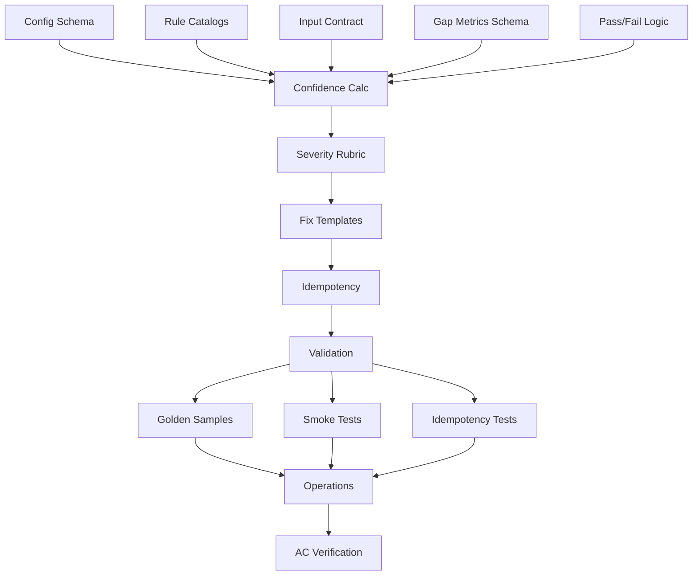

# Tasks: 005 Gap Analysis Rules System

**Feature:** Gap Analysis Rules & Metrics System  
**Issue Reference:** Issue #5 "M3: Define coverage and confidence metrics for knowledge gaps"

## Overview

Implement a deterministic, configurable rules system that evaluates documentation completeness across all artifact types (Kubernetes, FastAPI, COBOL, IRS, MUMPS) and generates quantified gap metrics for downstream visualization.

## Task Breakdown

### Phase 1: Foundation & Configuration (T001-T005)

#### T001: Define rule config schema (concept) [P]
**File:** `configs/schemas/rule_schema.json`  
**Description:** Create JSON Schema for rule configuration structure with required fields, allowed ranges, and validation constraints.
- Define rule structure: name, artifact_type, evaluation_sql, confidence_weights, severity, suggested_fix_template
- Set field constraints: severity [1-5], confidence_weights sum to 1.0, artifact_type enum
- Include validation rules for SQL template syntax and parameter validation
**AC:** documented rules; confidence present

#### T002: Author initial rule catalogs for all artifact types [P]  
**File:** `configs/rules/{kubernetes,fastapi,cobol,irs,mumps}/*.yaml`
**Description:** Create concrete rule definitions for each artifact type with severity and fix guidance.
- Kubernetes: deployment descriptions, resource limits, label standards
- FastAPI: endpoint docstrings, parameter docs, response schemas
- COBOL: PIC clause comments, data item descriptions
- IRS: record layout field descriptions, format specs
- MUMPS: FileMan field definitions, routine documentation
**AC:** rules exist for all types

#### T003: Normalize input contract [P]
**File:** `configs/schemas/input_contract.json`
**Description:** Document required source_metadata fields and mappings for each artifact type.
- Define chunk_id, artifact_type, text_content, kind, api_path, metadata requirements
- Specify artifact-specific field mappings and extraction rules
- Document data quality expectations and validation rules
**AC:** runnable metrics pipeline

#### T004: Specify gap_metrics column semantics [P]
**File:** `configs/schemas/gap_metrics_schema.json`  
**Description:** Define gap_metrics table columns with field meanings, ranges, and examples (conceptual, no DDL).
- Column definitions: chunk_id, artifact_type, rule_name, passed, confidence, severity, suggested_fix
- Field semantics: confidence [0.0-1.0], severity [1-5], suggested_fix max 500 chars
- Include idempotency key specification: (chunk_id, rule_name, ruleset_version)
**AC:** confidence stored; rerunnable output defined

#### T005: Design pass/fail logic [P]
**File:** `docs/evaluation_logic.md`
**Description:** Create narrative rubric for field presence and quality checks per rule.
- Define binary pass/fail decision tree: required fields → quality thresholds → validation rules
- Specify deterministic evaluation criteria with tie-breaking rules
- Document error handling for missing fields and unknown artifact types
**AC:** metrics populated with pass/fail

### Phase 2: Core Evaluation Engine (T006-T010)

#### T006: Design confidence computation
**File:** `src/gap_analysis/confidence_calculator.py`
**Description:** Implement confidence scoring algorithm with defined components and bounds.
- Formula: base_completeness * quality_multiplier - penalty_deductions
- Components: field presence ratio, content quality score, critical field penalties
- Include examples and boundary condition handling (0.0, 1.0 limits)
**AC:** confidence calculated and stored

#### T007: Define severity rubric (1–5)
**File:** `docs/severity_rubric.md`
**Description:** Create criteria and examples tied to impact using 5×5 risk matrix standard.
- Level definitions: 1=cosmetic, 2=minor gaps, 3=operational impact, 4=service risk, 5=critical
- Impact assessment rules and escalation logic
- Confidence-severity correlation rules (confidence < 0.2 → min severity 4)
**AC:** severity available in output

#### T008: Draft suggested_fix templates
**File:** `configs/templates/fix_templates.yaml`
**Description:** Create consistent, action-oriented guidance templates per rule using Mustache format.
- Template structure with conditional blocks and variable substitution
- Action-oriented language patterns: "Add", "Update", "Include"
- Maximum 500 character constraint with fallback generic messages
**AC:** suggested_fix present

#### T009: Specify idempotency key & overwrite behavior
**File:** `docs/idempotency_design.md`
**Description:** Articulate conceptual key and re-run semantics to avoid duplicates.
- Conceptual key: (chunk_id, rule_name, ruleset_version)
- Partition-based overwrite strategy with BigQuery transaction semantics
- Stale result detection and cleanup procedures
**AC:** rerun without duplication

#### T010: Create validation checklist
**File:** `src/gap_analysis/rule_validator.py`
**Description:** Implement ruleset linting for duplicate names, invalid severity, unknown artifact types.
- Schema compliance validation using JSON Schema
- SQL template syntax parsing and parameter validation
- Cross-reference checks and dependency validation
**AC:** reliable reruns

### Phase 3: Testing & Quality Assurance (T011-T013)

#### T011: Golden sample definitions [P]
**File:** `tests/golden_samples/{artifact_type}/`
**Description:** Create per artifact type input → expected gap_metrics rows (described, not implemented).
- Sample artifacts: complete, minimal, malformed versions per type
- Expected results with confidence scores and pass/fail outcomes
- Tolerance specifications for confidence score validation (±0.05)
**AC:** at least one rule per record

#### T012: Smoke test plan [P]
**File:** `tests/smoke/test_pipeline_coverage.py`
**Description:** Ensure pipeline yields >0 rows for sample dataset; define acceptance gate.
- Coverage validation SQL to verify ≥1 rule per source_metadata record
- Success criteria: uncovered_records = 0 for all artifact types
- Performance validation: <5 minutes for 10K records
**AC:** metrics populated

#### T013: Idempotency test plan [P]
**File:** `tests/integration/test_idempotency.py`
**Description:** Verify two consecutive runs produce same row count for same inputs.
- Test scenarios: identical re-run, version upgrade, partial failure recovery
- Verification queries to detect duplicate rows
- Concurrent execution safety testing
**AC:** no duplicates

### Phase 4: Operational Implementation (T014-T015)

#### T014: Operational runbook outline
**File:** `docs/operations_runbook.md`
**Description:** Define single command trigger, dry-run, logs; roles & responsibilities.
- Primary command: `make compute_metrics` with options (DRY_RUN, RULES_VERSION)
- Configuration validation steps and pre-execution checks
- Structured logging format and telemetry expectations
- Runtime envelope: 10K records <5 minutes, 100K records <30 minutes
**AC:** reproducible runs

#### T015: AC verification checklist
**File:** `tests/acceptance/test_acceptance_criteria.py`
**Description:** Step-by-step checks to confirm each acceptance criterion is met before sign-off.
- Automated AC validation tests mapping each bullet to verification method
- Integration with CI/CD pipeline for continuous validation
- Stakeholder sign-off procedures and documentation requirements
**AC:** all

## Parallel Execution Strategy

### Concurrent Task Groups

**Group 1 [P]: Configuration Design (T001-T005)**
```bash
# Can run in parallel - different files, no dependencies
Task("Define rule config schema", "T001") &
Task("Author rule catalogs", "T002") &  
Task("Normalize input contract", "T003") &
Task("Specify gap_metrics schema", "T004") &
Task("Design pass/fail logic", "T005")
```

**Group 2: Core Engine (T006-T010)**
```bash
# Sequential - shared concepts and dependencies
T006 → T007 → T008 → T009 → T010
```

**Group 3 [P]: Testing (T011-T013)**
```bash
# Can run in parallel - different test categories
Task("Golden sample definitions", "T011") &
Task("Smoke test plan", "T012") &
Task("Idempotency test plan", "T013")
```

**Group 4: Operations (T014-T015)**
```bash
# Sequential - runbook before acceptance testing
T014 → T015
```

## Dependencies



## File Impact Analysis

### New Files Created
- `configs/schemas/rule_schema.json` (T001)
- `configs/rules/{artifact_type}/*.yaml` (T002)  
- `configs/schemas/input_contract.json` (T003)
- `configs/schemas/gap_metrics_schema.json` (T004)
- `configs/templates/fix_templates.yaml` (T008)
- `src/gap_analysis/confidence_calculator.py` (T006)
- `src/gap_analysis/rule_validator.py` (T010)
- `docs/evaluation_logic.md` (T005)
- `docs/severity_rubric.md` (T007)
- `docs/idempotency_design.md` (T009)
- `docs/operations_runbook.md` (T014)

### Test Files Created
- `tests/golden_samples/{artifact_type}/` (T011)
- `tests/smoke/test_pipeline_coverage.py` (T012)
- `tests/integration/test_idempotency.py` (T013)
- `tests/acceptance/test_acceptance_criteria.py` (T015)

### Modified Files
- `Makefile` - Add `compute_metrics` target (T014)
- `requirements.txt` - Add rule validation dependencies (T010)

## Success Criteria

Each task enforces specific Acceptance Criteria:
- **T001-T002:** "documented set of rules exists for all artifact types"
- **T003-T004:** "Running `make compute_metrics` populates gap_metrics table"  
- **T011-T012:** "at least one rule applied per record"
- **T006:** "Confidence scores are calculated and stored"
- **T009-T013:** "rerun without duplicating results"

## Estimated Timeline

- **Phase 1 (T001-T005):** 3-4 days (parallel execution)
- **Phase 2 (T006-T010):** 4-5 days (sequential)
- **Phase 3 (T011-T013):** 2-3 days (parallel testing)
- **Phase 4 (T014-T015):** 1-2 days (operations)

**Total:** 10-14 days with parallel execution optimization